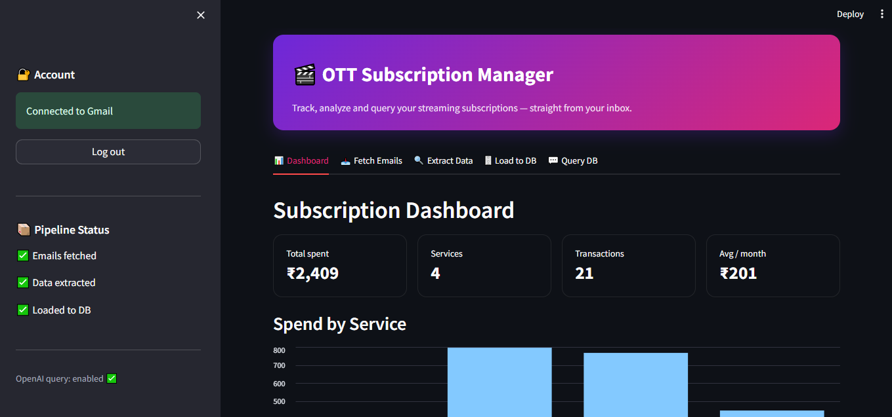
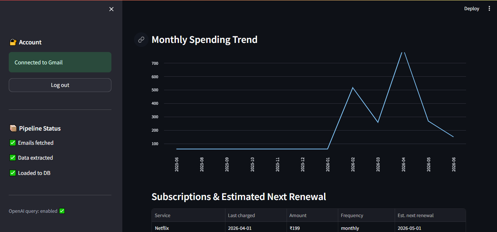
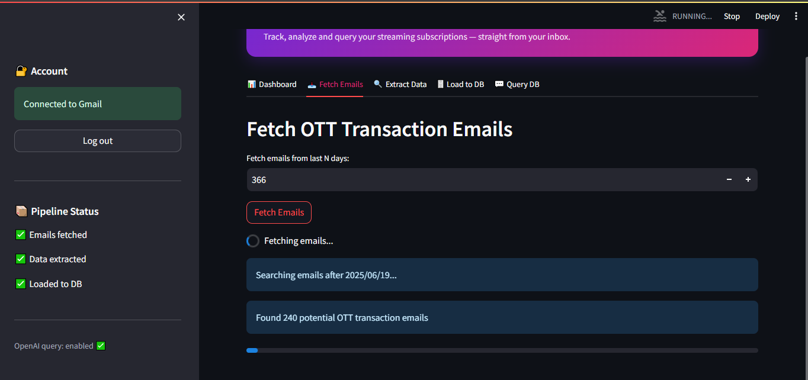
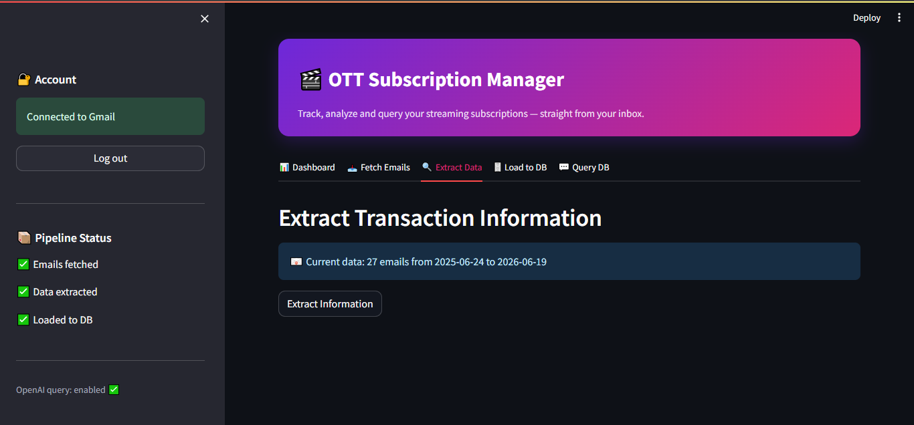
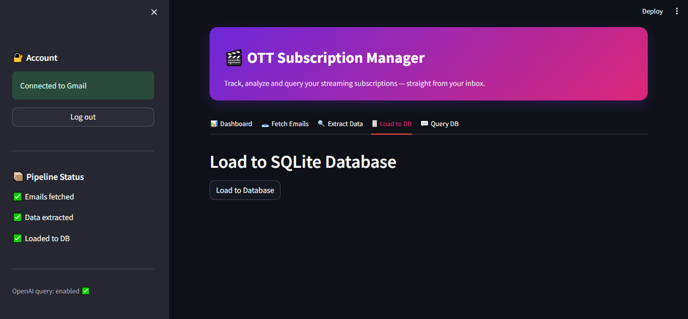
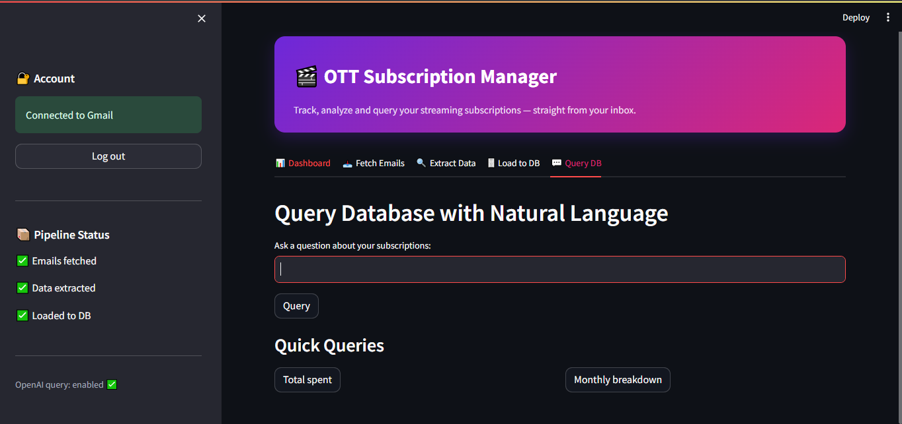

# 🎬 OTT Subscription Manager

A Streamlit app that scans your Gmail for OTT/streaming subscription charges
(Netflix, Spotify, Amazon Prime, Disney+ Hotstar, YouTube Premium, …),
extracts the amounts and billing frequency, stores them in a local SQLite
database, and lets you explore your spending — including a natural-language
"ask a question" mode powered by OpenAI.

> Personal-use tool. It reads **your own** inbox via Google OAuth and keeps all
> data on your machine.

---

## ✨ Features

- **📊 Dashboard** — total spend, per-service breakdown, monthly trend, and
  estimated next-renewal dates.
- **📥 Fetch Emails** — searches Gmail for OTT transaction emails and filters
  out promos / failed payments.
- **🔍 Extract Data** — parses service, amount, date, and monthly/yearly
  frequency from each email.
- **🗄️ Load to DB** — saves everything into SQLite with duplicate protection.
- **💬 Query DB** — ask questions in plain English (e.g. *"how much did I spend
  on Netflix this year?"*); answered via OpenAI → SQL → results.

## 📸 Screenshots

### Dashboard



### The pipeline
| Fetch Emails | Extract Data |
|---|---|
|  |  |

| Load to DB | Query (natural language) |
|---|---|
|  |  |

## 🔁 How it works

```
Gmail ──fetch──► ott_transactions.json ──extract──► ott_results.json ──load──► ott_subscriptions.db ──query──► answers
```

## 📁 Project structure

| File | Purpose |
|------|---------|
| `app_2.py` | Main Streamlit app (entry point) |
| `gmail_auth.py` | Google OAuth + Gmail service |
| `load_to_sqlite.py` | SQLite schema + insert logic |
| `query_db.py` | Natural language → SQL → answer (OpenAI) |
| `requirements.txt` | Python dependencies |
| `Dockerfile` / `docker-compose.yml` | Containerized run |

---

## 🚀 Setup

### 1. Get Google OAuth credentials (`credentials.json`)

1. Go to the [Google Cloud Console](https://console.cloud.google.com/) and create a project.
2. **APIs & Services → Library →** enable the **Gmail API**.
3. **APIs & Services → OAuth consent screen →** choose **External**, fill in the
   basics, add the scope `https://www.googleapis.com/auth/gmail.readonly`, and
   add your own email under **Test users**.
4. **APIs & Services → Credentials → Create Credentials → OAuth client ID →
   Application type: Desktop app.** Download the JSON and save it as
   `credentials.json` in this folder.

### 2. (Optional) OpenAI key for the Query tab

Create a `.env` file in this folder:

```
OPENAI_APIKEY=sk-your-key-here
```

The first three tabs work without this; only the **Query DB** tab needs it.

### 3. Install & run (local)

```bash
pip install -r requirements.txt
streamlit run app_2.py
```

Open http://localhost:8501, click **Connect Gmail** in the sidebar, and complete
the browser login once. This creates a `token.json` so you won't have to log in
again.

---

## 🐳 Run with Docker

The OAuth login needs a browser, which a container doesn't have — so
**authenticate once locally first** (step 3 above) to generate `token.json`.
After that the container refreshes the token silently.

```bash
docker compose up --build
```

Then open http://localhost:8501. Your code, secrets, and data are bind-mounted
from this folder, so everything persists across restarts.

---

## 🔒 Security notes

- `credentials.json`, `token.json`, `.env`, and the `*.db` / `*.json` data files
  are **git-ignored** — they are never committed.
- This app is intended for **personal use** (you, or up to 100 Google "test
  users" you add manually). Making it public would require migrating to a web
  OAuth flow and passing Google's verification for the restricted Gmail scope.
